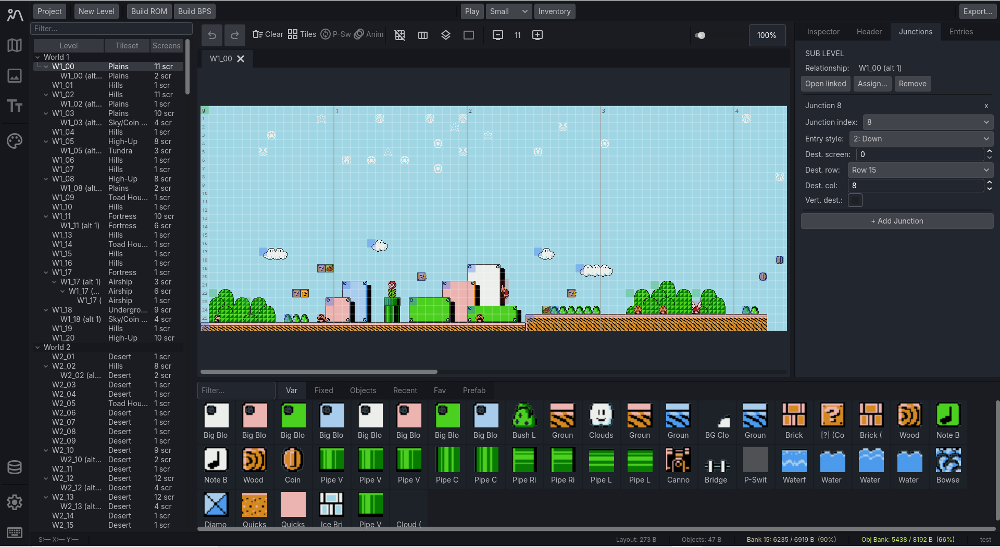

# Bank12

Bank12 is a project-based editor for the US `PRG1` release of `Super Mario Bros. 3`. You import a legally obtained base ROM, edit decoded project data in a workspace, and rebuild a fresh ROM or BPS patch when you want output.

This release is distributed as a packaged Windows application. Source code is not included here (yet).

## Requirements

- Windows
- A legally obtained `Super Mario Bros. 3` US `PRG1` ROM
- An emulator if you want to use the in-app `Play` workflow

## What Bank12 Does

- Creates project folders from a base SMB3 ROM and treats that folder as the editable source of truth
- Edits levels, world maps, CHR graphics, and in-game text in one workspace
- Rebuilds fresh `.nes` ROMs and `.bps` patches from the imported base ROM
- Tracks ROM and shared-bank usage for packed data instead of simple object counts
- Supports preview play with configurable emulator, inventory, and power-up state

## Getting Started

1. Download the packaged Bank12 zip.
2. Extract it to a normal folder.
3. Run the included `.exe`.
4. Create a project by choosing a project name, your base SMB3 ROM, and a destination folder.
5. Edit the decoded project data, then build a fresh ROM or BPS when you want output.

## How Projects Work

A Bank12 project is a normal folder, and that folder is the editable source of truth. The imported ROM is kept separately, decoded data is stored in project files, and build output is written fresh when you export.

The usual project contents are:

- `project.b12` for project metadata
- `base_rom/` for the imported ROM
- `levels/`, `worldmaps/`, `tilesets/`, and `text/` for editable data
- `build/` for generated output such as `.nes` and `.bps`

## Main Editors

- `Level Editor`: room layout, objects, junctions, headers, and level-specific settings
- `World Map Editor`: tiles, nodes, objects, shared map rules, and tile events
- `CHR Editor`: metatiles, object graphics, and raw tile editing
- `Text Editor`: letters, dialogs, HUD text, bonus text, and other in-game text

## Notes

- Bank12 does not include the game ROM
- Builds always start from the imported base ROM, not from the last exported ROM
- Project data autosaves while you work
- The editor is still in active development and things may change between versions

## License

Bank12 is distributed under the license in [LICENSE](LICENSE). Third-party notices live in [THIRD_PARTY_NOTICES.md](THIRD_PARTY_NOTICES.md).
